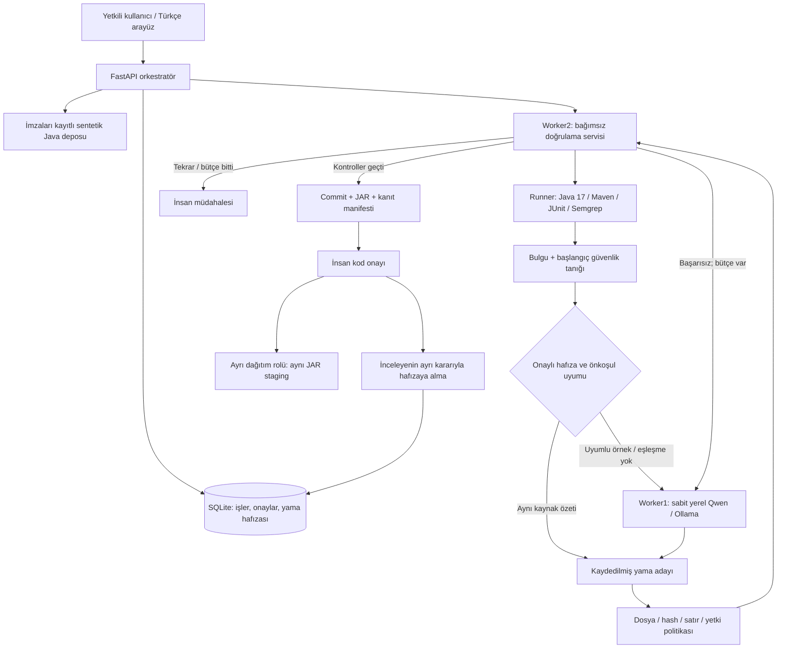

# SafePatch V0.1 — çalışan sürümün mimarisi

Bu belge kaynak kodun mevcut davranışını açıklar. `HEDEF_MIMARI_V2.md` daha geniş ürün hedefidir; oradaki her bileşen bu sürümde bulunmaz.

## Bileşenler

| Bileşen | Dosya | Sorumluluk ve yetki |
|---|---|---|
| Orkestratör | `safepatch/orchestrator.py`, `engine.py` | Yetki, sıra, iş durumu, deneme ve süre bütçeleri; otomatik insan onayı yok |
| Hafıza | `safepatch/memory.py` | İnsan onaylı yama, köken, proje kapsamı, uygunluk, kullanım izi, karantina/geri çekme |
| Yerel üretici | `safepatch/worker1.py` | Sabit model özeti; yapılandırılmış yama; bulgu ve geçmiş örnek talimat sayılmaz |
| Doğrulayıcı | `safepatch/worker2.py`, `acceptance.py` | Runner tutarlılığı, artifact özeti, aday commit ve kanıtı bağlama |
| Çalıştırıcı | `safepatch/runner.py` | Temiz çalışma dizini, Maven offline, korunan JUnit, gerçek Semgrep; Sonar adaptörü |
| Dağıtıcı | `safepatch/deployer.py` | Ayrı dağıtım rolü, HMAC kontrollü devir, aynı JAR ile yerel staging ve rollback |
| Tarayıcılar | `safepatch/scanner.py`, `rules/java.yml` | 3 sentetik güvenlik kuralı; Sonar sürüm/analiz kimliği/kural kapsamı kontrolleri |
| Arayüz | `safepatch/static/` | İş başlatma, diff ve kanıt, onay, hafıza yönetimi, ölçüm raporu |

## Uçtan uca kabul koşulu

Önce değiştirilmemiş kod derlenir. Meşru davranış testleri geçmeli, beklenen güvenlik tanığı başarısız olmalı ve tarayıcı bulgu üretmelidir. Bu önkoşul sağlanmazsa otomatik tamir başlamaz.

Her aday için temiz dizinde derleme, meşru davranış testleri, güvenlik tanığı, yeniden tarama ve korunan dosyaların hash kontrolü yapılır. Tüm koşullar geçmeden incelemeye hazır durumuna geçilmez. Testlerin geçmesi yalnızca bu testlerin kapsadığı davranışa ilişkin kanıttır; mutlak güvenlik veya genel doğruluk ispatı değildir.

Modelin değiştirebildiği tek dosya `src/main/java/demo/DemoService.java`dır. Test, Maven, CI, tarama ayarı veya onay politikasını değiştiremez. Kaynak SHA-256 uyuşmazlığı, bastırma işaretleri, yasak kabiliyetler ve 200 satır değişiklik sınırı kontrol edilir. Bu kontroller Java güvenlik sandbox'ı yerine geçmez.

## Hafıza nasıl çalışır?

Model ağırlıkları değişmez. SQL/Java projesinde daha önce onaylanmış bir yama, proje + kural + tür + Java sürümü + kaynak yolu + derleme hash'i + korunan test sözleşmesi hash'i ile karşılaştırılır. Eksik bilgi `unknown`, uyuşmazlık `incompatible` olur. İkisi de otomatik yeniden kullanılamaz.

Kaynak hash'i de aynıysa önceki yama yeniden uygulanır ve bütün testler çalışır; LLM çağrısı yapılmaz. Kaynak farklı, diğer koşullar uyumluysa önceki diff modele örnek veri olarak verilir. Uyumlu kayıt yoksa model yalnız mevcut bulguyu kullanır. Bu sürümde vektör veritabanı, AST/dataflow çıkarımı ve genel reçete sentezi yoktur; muhafazakâr hash/sözleşme eşleştirmesi vardır.

Kayıtlar ancak kod onayından sonra inceleyenin **ayrı hafızaya alma kararı** ile oluşur. Karantina veya geri çekme, o kayda dayanan bekleyen onayları iptal eder. Dağıtılmış işler sessizce geri alınmaz, uyarı üretilir. İş kabulü ve dağıtımı öncesinde hafıza durumu tekrar kontrol edilir. Başarısız denemeler iş kanıtında kalır; başarılı hafızaya otomatik eklenmez.

## Sınırlar ve çalışma profili

- En fazla 3 aday, varsayılan 1.200 saniye; model çağrısı öncesi token rezervasyonu ve gerçek kullanım telemetrisi.
- Sabit 8.192 bağlam / 2.048 çıktı; girdi için UTF-8 bayt üst sınırıyla muhafazakâr kontrol. Eksik token ölçümü sıfır kabul edilmez.
- Tek orkestratör süreci / tek tüketici. İşler SQLite'ta kalıcıdır; yeniden başlatmada sıradakiler alınır, yarıda kalanlar altyapı hatası olarak kapanır. Çoklu replika, leasing/fencing/outbox teslim edilmedi.
- İnceleme, aday commit/JAR/politika/kanıt hash'ine bağlıdır. Repo dışında merge/rebase ve üretim artifact doğrulaması bu demoda yoktur.
- Native çalıştırıcı aynı OS kullanıcısındadır. Yalnız sahip olunan sabit sentetik depolar kabul edilir. Gerçek müşteri depolarını bu profile eklemek uygun değildir.
- Docker/Compose dosyaları dağıtım taslağıdır; bu teslimde Docker çalışma testi yapılmadı. Tüm uygulamaya ait ağ izolasyonu, mTLS, HSM/asimetrik imza, HA ve kurumsal SSO sonraki aşamadır.
- SonarQube için canlı doğrulama yapılmadı; adaptör sözleşme testleri vardır. SonarQube lisansı/CodeFix ve Snyk bu demo için gerekli değildir.

## Satılabilir ürün için çıkış kapıları

Kayıtlı gerçek müşteri deposu adaptasyonu, Linux sandbox'ta kötü niyetli derleme testleri, bağımlılık/model imzalı offline yükleme, tam sistem egress ölçümü, bağımsız AppSec kabul seti ve müşteri pilotu tamamlanmadan bu sürüm “savunma/banka üretimine hazır” diye konumlandırılmaz.
