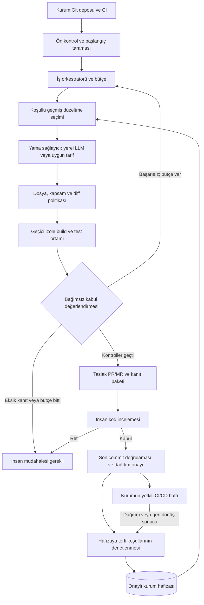
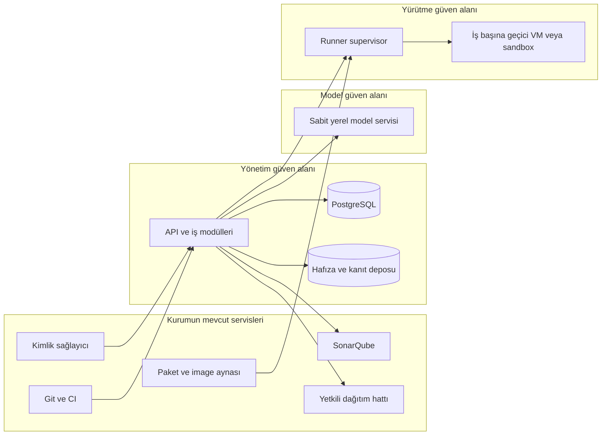
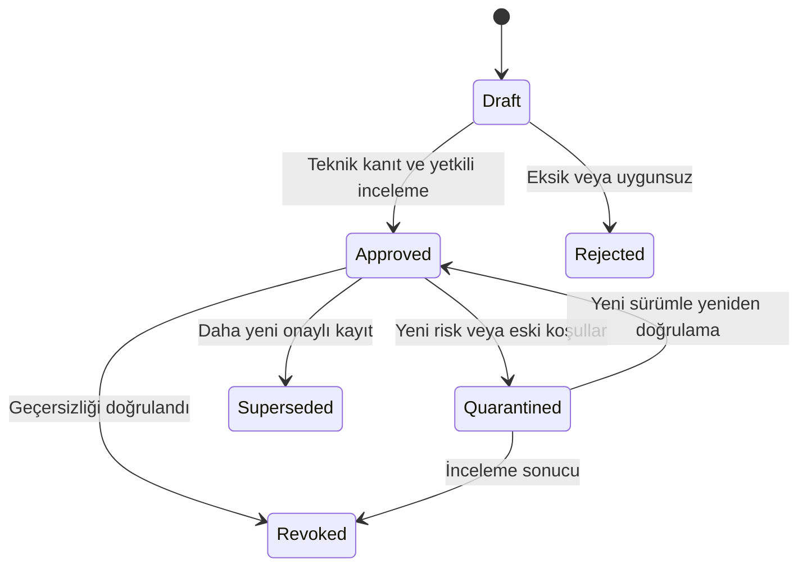
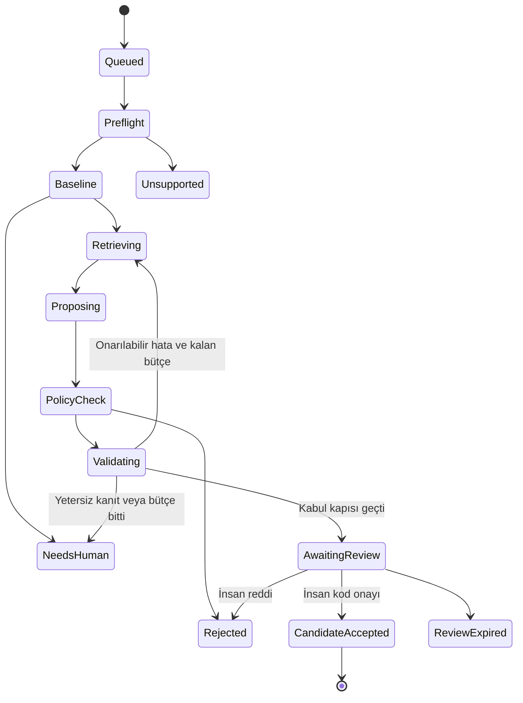

# SafePatch hedef mimarisi v2

Bu belge, araştırma önerileriyle güncellenmiş **uygulanacak sistem tasarımıdır**. Mevcut prototipin çalıştığı doğrulanan kapsamı `STATUS.md` içinde tutulur. Buradaki hafıza, kabul yöntemi, kurumsal izolasyon ve entegrasyonlar, yalnız tasarıma yazıldıkları için tamamlanmış kabul edilmez.

Ürün: **Kurum içinde çalışan, seçili Java güvenlik yamalarının uygun geçmiş bilgiyle üretilmesini, bağımsız kontrollerden geçirilmesini ve insan kararıyla ilerletilmesini sağlayan platform.** İlk ticari çıktı, incelemeye hazır değişiklik ve doğrulama kanıtıdır. Üretim dağıtımı kurumun mevcut yetkili CI/CD hattı üzerinden yürür.

## 1. Temel kararlar

| Konu | Mimari kararı |
|---|---|
| İlk kapsam | Java 17, Maven, belirlenmiş Spring/JDBC kullanım biçimleri; başlangıçta SQL injection ve path traversal. |
| Tarayıcı | Adaptör üzerinden SonarQube. Community Build ancak hedef kuralları canlı örneklerde doğrulanırsa kullanılır. Uygun mevcut ücretli lisans veya başka tarayıcı seçeneği değiştirilebilir. |
| Yama sağlayıcı | İlk sağlayıcı sabit yerel model; başlangıç adayı Qwen2.5-Coder-7B-Instruct. Ollama arkasında sağlayıcı arayüzü. Model/prompt/quantization sürümleri sabitlenir. |
| CodeFix | Zorunlu değildir. Uygun lisans, sürüm, desteklenen erişim ve offline koşullar doğrulanırsa alternatif yama kaynağı olur. Belgelenmemiş CodeFix API’si varmış gibi bağımlılık kurulmaz. |
| Öğrenme | Model ağırlıkları otomatik değişmez. Onaylı bilgi bağlama getirilir. Hafıza seçimi ve test yöntemi sürümlenir. |
| Güven sınırı | Model, müşteri kaynak kodu, build betikleri ve aday yamalar güvenilmeyen girdilerdir. Modelin olumlu değerlendirmesi kabul yetkisi taşımaz. |
| Kontrol uygulaması | Modüler bir FastAPI uygulaması; her mantıksal modül için ayrı mikroservis zorunlu değil. Ayrı yetki gerektiren model servisi, yürütücü ve dağıtım hattı ayrı güven alanlarıdır. |
| Kalıcı durum | Kurumsal kurulumda PostgreSQL; ilk pilotta bir scheduler. İş kuyruğu, durum, onay ve outbox aynı transaction sınırında yönetilir. SQLite yalnız mevcut yerel demo profilinde kalabilir. |
| Büyük dosyalar | Kurumun onaylı artifact deposu; yoksa dar yetkili artifact servisi ve içerik özetine göre dosya depolama. Büyük kaynak/diff/JAR dosyaları iş tablosuna gömülmez. |
| İlk kullanıcı deneyimi | Mevcut Git/CI ekranına bağlı PR/MR, kanıt özeti ve insan kararı. Yeni bir genel DevSecOps portalı geliştirmek MVP’nin önkoşulu değildir. |

### Araştırmadaki bütün önerilerin karşılığı

| Öneri | Mimari bileşeni | İlk teslimat / sonraki genişleme |
|---|---|---|
| F1: Koşullu hafıza | Memory Registry + Applicability Resolver | Kural/API/sürüm ve açık uyumsuzluk filtreleri; ardından veri akışı koşulu çıkarma ve karşılaştırmalı seçim yöntemi. |
| F2: Güvenlik ve davranışla kabul | Acceptance Engine + korunan test paketi | Derleme, güvenlik tanığı, meşru davranış ve rescan; ardından negatif kontrol/mutation ile test yeterliliği araştırması. |
| F3: İptal ve olumsuz deneyim | Memory Registry + Memory Usage kaydı | Yetki, köken, karantina/iptal ve etkilenen işleri bulma; ardından bağlama bağlı olumsuz örnek seçimi. |
| F4: Tarif veya LLM seçimi | Repair Provider Router | Başlangıçta yerel model ve varsa bir açık önkoşullu tarif; otomatik tarif türetme daha sonra. |
| F5: Bütçeli otomasyon | Budget Controller + durma politikası | Sabit süre/token/deneme tavanı ve tekrar duruşu; uyarlanabilir karar yöntemi ölçümden sonra. |
| F6: Offline kurulum ve kanıt | Offline Bundle Manager + Evidence Registry | Sürümlü paket, izinli bağlantılar, yeniden başlatma testi, artifact/onay bağı; HA ve Kubernetes daha sonra. |
| Lisans ve maliyet | Bileşen envanteri + kapasite ölçümü | Müşteriye ait üçüncü taraf hakları, model lisansı, kurulum/destek profili, iş başı kaynak ve insan zamanı. |
| Ticari doğrulama | Pilot/Evaluation modülü | Hafızasız, basit hafızalı ve önerilen yöntem; doğru kabul, hata, inceleme ve toplam maliyet. |

## 2. Ana işlem akışı



Oklar iş akışını gösterir; doğrudan ağ erişimi veya yazma yetkisi vermez. Özellikle model servisi hafızaya, Git’e, artifact deposuna veya dağıtım sistemine yazamaz. Bütçe dönüşü her denemede yeni bir kayıt üretir; aynı başlangıç commit’i ve hafıza sürümü korunur.

“Kontroller geçti”, belirtilen kapsamda yeterli kanıt bulunduğu anlamına gelir. Kodun bütün zafiyetlerden arındığı veya bütün davranışlarının doğru olduğu iddia edilmez.

## 3. Bileşenler ve yetki ayrımı

| Bileşen | Sorumluluk | Yetki sınırı |
|---|---|---|
| Git/CI Connector | İmzalı olay doğrulama, izinli depoyu sabit commit’ten alma, taslak PR açma, merge durumunu okuma. | Okuma ve PR yazma kimlikleri ayrıdır; üretim deploy yetkisi yoktur. Kullanıcıdan keyfi shell komutu almaz. |
| Preflight & Scanner Adapter | JDK/build/scanner kapsamını denetleme, temel build ve test durumunu kaydetme, bulguları normalleştirme. | Tarama hatasını boş bulgu listesi gibi sunamaz. Hotspot ile vulnerability ayrı türlerdir. |
| Orchestrator | İş durumu, lease, süre, deneme sırası, iptal ve idempotency. | Yama doğruluğunu tek başına ilan etmez; insan adına onay vermez. |
| Context Builder | Gerekli Java kodunu, ilgili API ve veri akışını, temizlenmiş tanıyı bağlama alma. | Depodan gelen talimatları yetki olarak yorumlamaz. Gizli anahtarları ve gereksiz kodu modele göndermez. |
| Memory Registry | Onaylı kayıtlar, köken/lisans, ACL, sürüm, iptal ve kullanım ilişkileri. | Model çıktısı doğrudan onaylı kayda dönüşmez. Proje yetkisi aramadan önce uygulanır. |
| Applicability Resolver | API/sürüm/akış/işlev koşullarına göre eleme ve sıralama; bilinmeyen koşulları açıklama. | Benzerlik puanını doğruluk sertifikası saymaz. Uygun kayıt yoksa hafızasız yol seçilir. |
| Repair Provider Router | Uygun tarif, yerel model veya lisanslı alternatif sağlayıcıyı seçme. | Sağlayıcı yalnız yapılandırılmış yama döndürür; kabul veya dağıtım kararı vermez. |
| Patch Policy | Yol, başlangıç hash’i, dosya/satır limiti, test/CI/politika değişikliği ve tarama bastırma kontrolü. | Aynı kontrol hem öneri alındığında hem yürütme öncesinde uygulanır. |
| Runner Supervisor | Onaylı yürütme profilinden kısa ömürlü ortam açma, süre/kaynak sınırı, öldürme ve sonuç toplama. | Runner yönetim yetkisi modelde veya müşteri build sürecinde değildir. Genel amaçlı Docker API vekili olmaz. |
| Acceptance Engine | Başlangıçla karşılaştırma; build, korunan testler, güvenlik kanıtı ve rescan sonucundan karar. | İkinci LLM görüşü isteğe bağlı yardımcı veridir; başarılı kabulün zorunlu veya yeterli koşulu değildir. |
| Evidence Registry | Manifest, diff, test/tarama kaydı, sürüm ve artifact digest’ini bağlama. | Koşum verisini imzalamak anlamsal doğruluğu ispatlamaz. Değiştirilen içerik özeti geçersiz olur. |
| Approval Service | Kurum kimliği/rolüyle kod ve dağıtım kararını hedef revizyona bağlama. | Worker veya iş açan servis kimliği insan reviewer rolü kazanamaz. |
| Release Connector | Geçerli onayı ve artifact özetini denetleyip kurumun dağıtım hattına teslim etme. | Modelden hedef ortam/komut almaz. Onaydan sonra yeniden build yapıp farklı paketi sessizce dağıtamaz. |
| Evaluation & Metrics | Deney kolları, tüm başarısızlıklar, maliyet, inceleme süresi ve doğruluk ölçümü. | Gizli değerlendirme yamalarını çalışma hafızasına veya model bağlamına aktarmaz. |

### Kurulum topolojisi

Üç **mantıksal güven alanı** önerilir; bunlar mutlaka üç ayrı fiziksel sunucu satın almak anlamına gelmez. VM yerleşimi kurumun tehdit modeli ve GPU erişimiyle belirlenir.



Model ve müşteri build’i aynı güvenilir süreçte çalıştırılmaz. Pilot için ayrılmış VM üzerinde tek kullanımlık yürütme ortamı uygundur; runtime seçimi kurumca desteklenen izolasyon teknolojisine göre yapılır. Mevcut aynı Windows kullanıcısıyla çalışan native süreçler bu kurumsal profilin karşılığı değildir.

PostgreSQL, mantıksal olarak metadata tutar; hafıza/kanıt deposundaki büyük nesnelerin içerik özetlerini ve erişim ilişkilerini kaydeder. Sonar’ın kendi veritabanı SafePatch iş tablolarıyla karıştırılmaz; ayrı veritabanı ve servis kimliği kullanılır.

## 4. İşin adım adım yürütülmesi

1. **İşi sabitle:** Depo yetkisini, commit’i, hedef modülü, scanner profilini, kabul politikasını ve model sürümünü kaydet. Aynı olay tekrar gelirse aynı işi döndür; farklı içerikle aynı idempotency anahtarı kullanılırsa reddet.
2. **Başlangıcı ölç:** Derleme ve meşru davranış testlerinin durumunu çıkar. Hedef güvenlik bulgusunu gerçek scanner çıktısıyla eşleştir. Mümkünse savunmasız davranışı gösteren tanık test çalıştır. Önceden bozuk testleri kaydet; bunu yeni yamanın hatasıyla karıştırma.
3. **Kapsam kararı ver:** Desteklenmeyen JDK/API/kural, eksik modül analizi veya doğrulanamayan güvenlik etkisinde otomatik kabul yolunu kapat. Triage ve insan incelemesi ayrı çıkışlardır.
4. **Geçerli bilgi ara:** Önce kurum/proje yetkisi ve kayıt durumu; sonra kural, Java/API sürümü ve güvenlik koşulu filtreleri; en son benzerlik/sıralama. Getirilen kayıt kimliği ve nedenleri saklanır.
5. **Yama üret:** Uygunluğu açıkça doğrulanan tarif varsa değerlendir; aksi halde sınırlı bağlamla yerel model. Hiç hafıza kaydı yoksa aynı doğrulama akışı hafızasız çalışır.
6. **Yama sınırını denetle:** Yalnız izinli Java kaynak yolları. Başlangıç dosya hash’i eşleşmeli. Testler, build dosyaları, scanner kuralları, CI, güvenlik politikası ve dependency sürümleri başlangıç kapsamına dahil değildir.
7. **Bağımsız değerlendir:** Yama temiz başlangıca uygulanır. Kontrollü ortamda build, korunan güvenlik/meşru davranış testleri ve son tarama çalışır. Kalan/yeni bulgular, analiz kapsamı ve test yürütme kanıtı karşılaştırılır.
8. **Tekrar veya dur:** Yalnız izinli, temizlenmiş hata özeti sonraki öneriye verilir. Yinelenen diff, aynı başarısızlık imzası, politika ihlali veya bütçe bitiminde insan kuyruğuna aktarılır. Altyapı hatası yama başarısızlığı gibi öğrenilmez.
9. **İncelemeye sun:** Taslak PR/MR, diff, hedef bulgu, kullanılan hafıza, test kanıtı, kalmış belirsizlikler ve maliyet gösterilir. İnsan yeni bir kod değişikliği yaparsa bu yeni aday revizyondur.
10. **Son revizyonu doğrula:** Merge/rebase/squash ile oluşan gerçek commit için kaynak, profil ve artifact ilişkisini yeniden kur. Gerekli kontrolleri ve dağıtım onayını bu revizyona bağla.
11. **Dağıtıma teslim et:** Kurumun mevcut CI/CD hattı yalnız geçerli release manifesti ve aynı artifact digest’iyle ilerler. Staging ve üretim izinleri ayrıdır.
12. **Hafızaya terfi ettir:** Teknik doğrulaması ve yetkili kod onayı bulunan, merge olmuş nihai düzeltme kayıt olmaya adaydır. Memory Curator gerekli alanları ve lisansı doğrular. Dağıtım durumu sonradan eklenir; geri alınma nedeni güvenlik/doğruluksa kayıt karantinaya taşınır.

## 5. Düzeltme hafızası

### Kayıt modeli

| Alan grubu | Tutulacak bilgi |
|---|---|
| Kimlik/yetki | `memory_id`, kurum, proje kapsamı, erişim politikası, kayıt sürümü. |
| Kaynak | Depo ve başlangıç/son commit, canonical diff digest’i, yamanın insan/model/tarif kökeni, kullanım/dağıtım hakkı. |
| Bulgu | Scanner/kural/CWE eşlemesi, source-sink bilgisi, kural/profil sürümü; CWE yoksa uydurulmaz. |
| Geçerlilik | Java sürümü, framework/kütüphane/API, işletim sistemi/dosya semantiği, veri akışı ve yetki varsayımları. |
| Korunacak davranış | Meşru girdiler, beklenen çıktı/yan etki, bilinçli güvenlik değişikliği, izin verilen başarısızlık biçimi. |
| Kanıt | Build/test/scan manifesti, güvenlik tanığı, final artifact ve kaynak digest’leri, onaylayan kimlik ve karar zamanı. |
| Durum/ömür | Taslak/onaylı/karantina/iptal, geçerlilik süresi veya değişiklik tetikleyicisi, iptal nedeni, yerini alan kayıt. |
| Kullanım ilişkisi | Bu örneği kullanan işler ve adaylar, ret nedeni, kullanım anındaki koşullar; başarı/ret ölçümünün paydası. |

“Onaylı”, kaydın her projede kullanılabileceği anlamına gelmez. SQL sorgusundaki veri değerini parametreleştiren bir yama, kullanıcı tarafından seçilen tablo/sütun adını güvenli hale getiren genel çözüm değildir. JDBC ile ORM sorgusu, farklı path/symlink semantiği veya sürümde kaldırılan API ayrıca değerlendirilir.

Resolver sonucu dört durumdan biri olmalıdır: `compatible`, `incompatible`, `unknown`, `no_match`. `unknown` durumunu modelin güven skoru ile `compatible` yapmayın. İlk profil belirsiz örneği onarım kalıbı olarak kullanmaz; gerekirse hafızasız öneri veya insan müdahalesi seçer. Her durumda yeni yama yeniden doğrulanır.



Eski içerik sessizce değiştirilmez; yeni kayıt sürümü üretilir. İptal transaction’ı ilgili işleri işaretler. Yeni getirmeler anında durur; halen çalışan işte kullanılan kaydın durumu kabul ve release kapısında tekrar kontrol edilir. Geriye dönük kullanım listesi üzerinden inceleme açılır. Bir örneğin iptali, onunla üretilmiş bütün yamaların kesin hatalı olduğu anlamına gelmez; her iş yeniden değerlendirilir.

Olumsuz deneyim, **başarısız aday + bağlam + neden + kanıt** olarak saklanır. Maven sunucusunun erişilememesi düzeltme stratejisinin yanlış olduğuna dair örnek değildir. Başarısız yamalar onaylı örnek havuzuna karışmaz.

Kurumlar arası otomatik hafıza paylaşımı yoktur. Ortak başlangıç paketi yalnız hakları açık ve bağımsız sınanmış örnek/tariflerden oluşur. Model veya embedding servisi internetten örnek aramaz. Vektör arama ilk MVP için zorunlu değildir; veri büyüdüğünde ayrı ölçümle eklenebilir.

## 6. Kabul yöntemi: scanner sonucundan fazlası

| Kontrol | Geçme koşulu | Geçmeme veya belirsizlikte davranış |
|---|---|---|
| Kapsam ve tamlık | Scanner doğru commit/modülü/profili analiz etmiş; zorunlu kurallar çalışmış. | `coverage_missing` veya `scan_error`; temiz sonuç yok. |
| Patch politikası | İzinli dosyalar, hash ve limitler; test/CI/politika bastırma yok. | Politika ihlali; yeni deneme hakkı otomatik verilmez. |
| Build | Sabit toolchain ve beklenen kaynaklardan başarı; artifact manifesti mevcut. | Yama kaynaklı build hatası ile altyapı hatası ayrılır. |
| Güvenlik tanığı | Savunmasız davranışı gösteren test, yamada beklenen güvenli davranışı gösteriyor. | Sadece uyarı kaybolması otomatik kabul için yeterli değil. |
| Meşru davranış | Kritik normal girdiler, yetki, veri ve yan etkiler korunmuş. | İşlev kaybı veya tanımsız gereksinim insan müdahalesine gider. |
| Yeniden tarama | Hedef bulgu giderilmiş; politika kapsamındaki yeni/yükselen bulgular yok. | Kalan bulgu varsa uygun hata geri bildirimiyle sınırlı tekrar. |
| Test yeterliliği | Gerekli güvenlik sözleşmeleri yürütülmüş; tanımlı negatif kontrolleri ayırt ediyor. | Yetersiz kanıtta `needs_human`; “passed” etiketi yok. |
| Kanıt bütünlüğü | Sonuçlar aynı kaynak, test paketi, profil, model/prompt ve deneme kimliğine bağlı. | Eksik/çelişkili/geçersiz manifest kabulü engeller. |

Korunan testler yama yazılabilir alanının dışında, sürümlü ve yalnız okunur sağlanır. Yalnız modelin ürettiği testlerin geçmesi yeterli değildir. Bir model test önerebilir; testin sözleşmeye uygunluğu ayrı süreçte doğrulanır ve sonra korunan pakete alınır.

F2’nin Ar-Ge kısmı, güvenlik kontrolünü kaldıran veya bütün meşru işlemi kapatan sınırlı negatif kontrol yamalarıyla testlerin ayırt etme gücünü sınar. Her aday için bütün mutation uzayını çalıştırmak yerine kural/sink ve maliyetle sınırlı bir seçim araştırılır. Bu kontrolün kendi CPU ve insan maliyeti ölçülür; negatif kontrol yamaları release veya onaylı hafıza adayı olamaz.

Kural çıktısı ve JUnit XML dosyası tek başına güvenilir otorite değildir: müşteri build’i bu dosyaları taklit edebilir. Ayrı supervisor/test harness; gerçekten başlatılan süreçleri, çıkış durumunu, beklenen test kimliklerini ve artifact’leri bağlar. Kodun kötü niyetli çalışması veya testleri atlatması riski tamamen ortadan kalkmaz; kontrol ortamının ele geçirilmesi tehdit sınırıdır.

## 7. İnsan onayı, merge ve dağıtım

**Kod incelemesi** ile **dağıtım yetkisi** ayrı kararlardır. Kurum politikası bunları aynı kişinin ekranında sunabilir; backend kayıtları ve yetkileri yine ayrı tutulur. MVP’de otomatik üretim merge/deploy yoktur.

Onay kaydı şu alanları kapsar:

```text
approval_id, approval_kind, actor_subject, role, project_id, job_id
candidate_revision, final_commit, source_tree_digest, diff_digest
artifact_digest, evidence_manifest_digest, policy_digest
target_environment, created_at, expires_at, nonce, signature_key_id
```

- Aday dosya değişirse ilgili teknik sonuç ve kod onayı geçersizleşir.
- PR başka commit’e rebase/merge edilirse son revizyon kontrol edilir. İlk uygulama, merge sonrası yeni build/test/scan ve release kanıtı üretir; eski artifact’in aynı olduğu varsayılmaz.
- Son kaynak ve doğrulanan paket hazır olduktan sonra dağıtım onayı alınır. Onaydan sonra rebuild gerekiyorsa yeni digest için yeni dağıtım onayı gerekir.
- Aynı commit korunarak fast-forward yapılabilen kontrollü durumda kanıt yeniden kullanımı ileride açık bir politika olarak eklenebilir; MVP optimizasyonu değildir.
- Dağıtım servisi geçerli imza, güncel durum, süre, hedef ortam ve artifact digest’ini denetler. Model ve yürütücüye bu servisin kimliği verilmez.
- Onay iptali dispatch öncesinde etkilidir. Başlamış dağıtım sihirli biçimde geri alınmış sayılmaz; kurumun durdurma/rollback prosedürü çalışır.
- Rollback yalnız önceden doğrulanmış, onaylı ve kullanılabilir olduğu denetlenmiş bir pakete gider. Veri tabanı migration’ları ve bunların geri dönüşü MVP onarım kapsamı dışındadır.

Hafıza terfisi, kod onayı + nihai commit doğrulaması + merge durumu + Memory Curator politikasıyla yapılır. Sadece “deploy düğmesine basıldı” olayı yeterli değildir. Dağıtıma henüz çıkmamış bir kayıt bu niteliği açıkça taşır. İşletim kaynaklı rollback otomatik güvenlik hatası sayılmaz; doğruluk/güvenlik kaynaklı geri dönüş karantina incelemesini tetikler.

## 8. İş durumu, kuyruk ve kaynak bütçesi

Onarım işi, insan kararı, release ve hafıza kaydı farklı varlıklardır. Birinin başarısı diğerini otomatik başarılı yapmaz.



Şemaya ek olarak bütün aktif teknik durumlar `Cancelled`, `InfrastructureError` veya `BudgetExhausted` ile sonlanabilir. `CandidateAccepted` üretim dağıtımı demek değildir; ayrı release kaydı `FinalValidation -> AwaitingReleaseApproval -> Ready -> Deploying -> Deployed/Failed/RolledBack` akışını taşır.

### İlk pilot politikası

| Sınır | Başlangıç değeri / davranış |
|---|---|
| Yama denemesi | En çok 3 öneri; her aday temiz başlangıç commit’ine uygulanır. |
| Değişiklik | En çok 3 izinli Java dosyası, toplam 200 değişen satır. |
| Otomatik iş süresi | Başlangıç build/tarama dahil en çok 1.200 saniye. Kuyruk ve insan bekleme süreleri ayrıca ölçülür. Uzun projeler için açıkça başka profil gerekir. |
| Model bağlamı | Çağrı başına en çok 8.192 toplam bağlam: 6.144 giriş ve 2.048 çıkış token’ı başlangıç tavanı; sağlayıcının bağlam ayarıyla birlikte denetlenir. |
| Toplam token bütçesi | İş başına 32.768 giriş+çıkış token’ı başlangıç tavanı; getirme/seçim/test önerisi için kullanılan bütün AI çağrıları dahil. |
| Tekrar duruşu | Aynı canonical diff veya aynı tanımlı başarısızlık imzasında dur. LLM’in “bir kez daha dene” isteği bütçeyi değiştiremez. |
| Altyapı tekrarı | İdempotent bir adım için en çok 1 teknik yeniden deneme; toplam süreyi sıfırlamaz, yama başarısı metriğine girmez. |
| İnsan onayı | Başlangıçta 24 saat geçerlilik; kurum politikasıyla değişir. Süre dolunca aynı onay kullanılamaz. |
| Eşzamanlılık | İlk pilotta bir onarım işi; yük ölçülünce kapasite artırılır. |

Bu değerler tasarım başlangıcıdır, model kalitesi veya süre garantisi değildir. Token sayacı bulunmuyorsa “ölçülmüş token” uydurulmaz; çağrı öncesi tokenizer veya muhafazakâr rezervasyonla sınır konur ve ölçüm eksikliği kayda geçirilir. Gerekli bağlam kesilerek anlamsız hale gelirse sessiz truncation yerine `needs_human` üretilir.

### Dayanıklılık

- Kalıcı iş tablosu, atomik durum geçişi ve sürüm kontrolü kullanılır. Yalnız Python process kilidi çoklu worker için yeterli değildir.
- İşi alan worker’a `lease_owner`, `lease_until`, artan `lease_epoch` atanır. Her sonuç mevcut epoch ile eşleşmelidir; eski worker’ın geç gelen sonucu state’i ilerletemez.
- İş claim için kısa PostgreSQL transaction’ı ve gerektiğinde `FOR UPDATE SKIP LOCKED` kullanılabilir. Uzun model/build çalışması boyunca transaction açık tutulmaz.
- Durum değişikliği ve dış sisteme gönderilecek olay aynı transaction’da outbox’a yazılır. Teslimat en az bir kez olabilir; Git/CI tüketicileri olay kimliği ve artifact digest’iyle idempotent çalışır. “Exactly once” varsayımı kurulmaz.
- İptal supervisor’a iletilir; belirlenen sürede kapanmayan işin tüm geçici ortamı sonlandırılır. Geç gelen callback kabul veya dağıtım üretemez.
- Restart sırasında aktif ortamla DB durumu uzlaştırılır. Ne olduğu bilinmeyen iş başarılı sayılmaz; kısıtlı yeniden koşum veya insan/altyapı incelemesi seçilir.
- İlk kurulumda tek scheduler vardır; çoklu scheduler/HA açılmadan lease, yarış, iptal ve onay testleri tamamlanır.

## 9. Sandbox, ağ ve çevrimdışı tedarik

Maven komutunun sabit olması, depodaki `pom.xml`, plugin veya Java kodunun güvenilir olduğu anlamına gelmez. Müşteri build’i kod çalıştırır. Bu yüzden model üretiminden bağımsız yürütme izolasyonu gerekir.

### İş ortamı

Runner supervisor, sınırları belli bir `RunnerProfile` alır; kullanıcı/LLM girdisini shell komutuna veya container parametresine dönüştürmez. Kaynak anlık görüntüsü, izinli patch, korunan test paketi ve hazırlanmış bağımlılıklar sağlanır. Yönetim servisi sırları, SSH agent, Docker socket, host ev dizini ve üretim erişimi ortamda bulunmaz.

Geçici root dosya sistemi, izinli yazılabilir çalışma alanı, süreç/RAM/CPU/disk/süre limitleri ve ayrı iş kimliği kullanılır. Tek başına Docker kullanılması güçlü izolasyon veya “sıfır sızıntı” iddiası değildir. Kurum riskine göre VM, microVM veya sertleştirilmiş sandbox çalışma profili seçilir.

Veritabanı isteyen entegrasyon testleri için yalnız o işe ait geçici DB/servisler sağlanır. `network none`, ağ gerektirmeyen işler için bir seçenek olabilir; bu DB’li işte yalnız iş içi ağa izin verilir. Her iki profilde yönetim ağı, model servisi, internet ve üretim servisi erişimi kapalıdır.

### Ağ izin matrisi

| Kaynak | İzinli hedef | Amaç ve sınır |
|---|---|---|
| Kullanıcı/CI | SafePatch API | Kurum içi TLS, kimlik/rol ve proje kapsamı; yönetim API’si internete açılmaz. |
| Kontrol uygulaması | PostgreSQL, hafıza/artifact servisi | Ayrı servis kimlikleri, yalnız gerekli veri işlemleri. |
| Yama sağlayıcı istemcisi | Kayıtlı yerel model endpoint’i | İçerik boyutu ve süre sınırı; bulut fallback, redirect ve keyfi URL yok. |
| Git connector | Kayıtlı kurum Git sunucusu | Depo/branch allowlist’i; okuma ve PR yazma yetkileri ayrı. |
| Scanner işi / adaptörü | Belirli Sonar projesi ve sunucusu | Sınırlı tarama kimliği; diğer yönetim servislerine erişim yok. |
| Runner supervisor | Paket/image aynası ve artifact girdi alanı | Önceden onaylı içerik hazırlama; üretim veya Git yazma yetkisi yok. |
| Build/test sandbox | Kendi geçici test servisleri | Gerek yoksa hiç ağ yok; gerekiyorsa yalnız iş içi servisler. |
| Release connector | İzinli kurum CI/CD endpoint’i | Geçerli insan onayı, manifest ve hedef ortam; genel shell/SSH yetkisi yok. |
| Bütün çalışma bileşenleri | İnternet | Kapalı çalışma profilinde engelli. Güncelleme ayrı kontrollü aktarım sürecidir. |

Özel IP adresi tek başına güven değildir. DNS, yönlendirme, proxy, kimlik, hedef allowlist’i ve mümkünse karşılıklı TLS birlikte uygulanır. Yerel model API çağrısı internet gerektirmez; dış bağlantı gereksinimi gerçek endpoint ve ürün konfigürasyonundan belirlenir.

Scanner kimliği müşteri build sürecine verilmez. Build çıktıları sabitlenip ayrı scanner işine aktarılır; Sonar için gereken bytecode/bağımlılık kapsamı canlı fixture ile doğrulanır. Bir kurulum yalnız Maven plugin akışıyla çalışabiliyorsa plugin’in repo koduyla birlikte çalışacağı kabul edilir; kısa ömürlü, tek proje kapsamlı token ve ayrı scanner izolasyonu tasarlanır. Testin çalıştığı ortama tam Sonar yönetici token’ı verilmez.

Bağımlılık hazırlığı için Maven/plugin çalıştırılması gerekiyorsa bu da ayrı bir hazırlık sandbox’ında yapılır. Yalnız kurumun paket aynasına sınırlı okuma izni vardır; supervisor veya kontrol uygulaması içinde müşteri build betiği çalıştırılmaz. Hazırlanan içerik manifestle sabitlenir, sonra ağsız test ortamına taşınır.

### Offline güncelleme hattı

1. Yetkili hazırlama ortamında model, tokenizer, JDK, build aracı, Maven plugin/bağımlılıkları, Python paketleri, scanner kuralları ve image’lar toplanır.
2. Her bileşenin kökeni, lisansı, sürümü ve digest’i envantere kaydedilir. Kurumca onaylı imzalı aktarım manifesti hazırlanır.
3. Paket kapalı ağın karantina alanına alınır; imza, içerik ve kabul politikasına uygunluk doğrulanır.
4. Yerel aynaya kontrollü terfi yapılır. Model ve prompt otomatik güncellenmez; değişiklik yeni profil ve değerlendirme gerektirir.
5. Bağlantısız yeniden başlatma, lisans/kimlik süresi, eksik paket, DB kurtarma ve rollback senaryoları çalıştırılır.
6. Gelecekte SCA/imaj tarayıcıları eklenirse zafiyet DB’sinin yaşı ve son başarılı güncellemesi kanıtta görünür; eski DB ile “güncel temiz” sonucu verilmez.

Çalışma verileri kullanıcı dosya senkronizasyon alanlarında tutulmaz. Ham loglar, dump ve destek paketleri de kaynak kodu içerebilir; varsayılan olarak kurumda kalır, saklama ve dışa aktarma izinleri ayrı uygulanır.

## 10. Veri, kimlik ve kanıt sözleşmeleri

### Temel veri varlıkları

`Project`, `RepositorySnapshot`, `Finding`, `RepairJob`, `Attempt`, `VerificationRun`, `MemoryRecord`, `MemoryUse`, `Approval`, `Release`, `Artifact`, `AuditEvent`, `OutboxEvent`, `ExperimentRun`.

`Finding` içinde `target_kind=source|dependency|image`, araç/profil/kural, analiz/commit kimliği ve kapsam bulunur. İlk otomatik onarım yalnız `source` türünü kabul eder. Snyk, Trivy veya Grype adaptörü daha sonra eklendiğinde her bulgu aynı Java yama döngüsüne zorlanmaz; bağımlılık/imaj için ayrı onarım ve doğrulama profili gerekir.

### API sınırları - önerilen sözleşme

```text
POST /v1/jobs                      project_id + approved_commit + finding_ids + policy_id
GET  /v1/jobs/{id}                 durum, bütçe, izinli kanıt özeti
POST /v1/jobs/{id}/cancel          iptal talebi
POST /v1/approvals                 tür, exact revision/manifest digest, insan kararı
POST /v1/memory/{id}/quarantine    neden, kanıt, yetkili kimlik
POST /v1/memory/{id}/revoke        neden, kanıt, yetkili kimlik
POST /v1/releases                 nihai manifest + hedef ortam + onay referansı
```

Yukarıdaki yollar uygulanmış API iddiası değildir. Dışarıdan model endpoint’i, repository URL’si, shell komutu, çalışma dizini, container ayrıcalığı veya serbest deploy hedefi alınmaz. Bunlar yönetici tarafından kayıtlı kaynak/profil kimliklerinden çözülür. Worker callback’leri public API’den ayrı servis kimliği, job/attempt/lease kapsamıyla doğrulanır.

### Evidence manifest

```text
schema_version, job_id, attempt_id, lease_epoch
repository_id, base_commit, candidate_commit, source_tree_digest, patch_digest
model_id, model_weights_digest, quantization, tokenizer_digest, prompt_digest
memory_snapshot_id, selected_memory_versions, applicability_result
toolchain_profile_digest, dependency_manifest_digest, runner_image_digest
scanner_version, scanner_profile_digest, analysis_id, analysed_commit, scan_completeness
protected_test_bundle_digest, executed_test_ids, baseline_results, candidate_results
security_witness_results, behavior_results, acceptance_decision, reason_codes
resource_usage, measurement_gaps, artifact_digests, created_at, signer_key_id
```

Kanıtlar canonical biçimde özetlenir; güvenilir servis kendi ürettiği koşum manifestini kurumun imzalama mekanizmasıyla imzalar. Hedef tasarımda onay imzalama özel anahtarı model/runner/dağıtıcıda tutulmaz; dağıtıcı doğrulama anahtarıyla kontrol eder. Mevcut prototipin paylaşılan HMAC yapısı bu yetki ayrımına geçiş gerektirir.

Append-only uygulama logu, veritabanı yöneticisine karşı değiştirilemez kayıt demek değildir. Değişiklik tespiti için zincirlenmiş olay özetleri/imzalar, kurumun ayrı SIEM veya onaylı saklama alanına kontrol noktası aktarımı ve erişim denetimi birlikte değerlendirilir. Sıralama/retention politikası ve anahtar döndürme prosedürü açık olmalıdır.

Roller: `developer`, `reviewer`, `memory_curator`, `release_approver`, `operator`, `auditor`. İnsanın kurum kimliği ile worker servis kimliği ayrıdır. İlk kurulum tek kurumdur; buna rağmen proje bazlı erişim hafıza, log, arama ve artifact indirmeye uygulanır. RBAC yalnız arayüzde saklama değil backend zorunluluğudur.

Model servisinde istem/yanıt logları varsayılan kapalıdır; gerekli debug kaydı ayrı süre ve erişim politikasıyla açılır. İstem önbelleği ve izleme kayıtları proje sınırını aşmamalıdır. Secret taraması sadece maskeleme değildir: maskeleme yüzünden geçerli yama üretilemiyorsa iş güvenilir bağlam hazırlanması için insan müdahalesine gider. Modelin maskelenmiş değerleri gerçek kaynak koduna yazmasına izin verilmez.

## 11. Teknoloji ve lisans seçimi

| Katman | Başlangıç seçimi | Satın alma/işletim kararı |
|---|---|---|
| API ve iş modülleri | Mevcut Python/FastAPI kodu | Parçaları tek kontrol uygulamasında düzenle; gereksiz servis/mesaj kuyruğu sayısını artırma. |
| İş, metadata ve kuyruk | PostgreSQL | Desteklenen sabit sürüm, yedek ve geri yükleme. Pilot için ayrıca Redis/Kafka zorunlu değil. |
| Hafıza araması | Yapılandırılmış alanlar + basit metin araması | Veri/ölçüm gerektirirse yerel embedding ve vektör arama ekle; zorunlu ayrı vektör DB yok. |
| Model | Qwen2.5-Coder-7B-Instruct aday; Ollama ilk sunucu | Mevcut modelle başlangıç ölçümü yap; kalite yetersizse aynı protokolle alternatif model. Adı değil gerçek ağırlık/lisans/digest kaydı esas. |
| Scanner | Sonar adaptörü | Community hedef kapsamı doğrulanırsa ücretsiz seçenek; ücretli sürüm için müşterinin uygun hakkı veya ayrı ticari düzenleme. |
| Build/test | Java 17, Maven, JUnit; iş için geçici servisler | Offline hazırlanmış toolchain ve dependencies. Sürüm matrisi pilotta sınırlı tutulur. |
| İzolasyon | Ayrı yürütme VM’si ve iş başına geçici ortam | Müşteri kodunun riskine uygun runtime; native aynı kullanıcı modu kurumsal teslimat olmaz. |
| Git/CI | Kurumun mevcut Git ve Jenkins/GitLab CI akışlarından biri | İlk müşteri için tek entegrasyon profili; sonraki adaptör müşteri ihtiyacıyla. |
| Kimlik/anahtar | Kurum IdP’si ve onaylı anahtar yönetimi | Yeni IdP veya sır yönetim ürününü zorunlu satmak yerine mevcut altyapıya uyum. |
| Artifact/kayıt | Kurum artifact servisi, SIEM ve yedek sistemi | Saklama, immutable özellik iddiası, imzalar ve yönetici erişimi gerçek kurulumda doğrulanır. |

**Model lisansı:** İncelenen Qwen2.5-Coder-7B-Instruct modeli Apache 2.0 lisanslıdır. DeepSeek-Coder-V2’nin model lisansında askerî kullanım kısıtı vardır; savunma için varsayılan model listesine alınmaz. Bu, bütün Qwen veya DeepSeek modellerinin aynı lisanslı olduğu anlamına gelmez. Gerçek dağıtılacak checkpoint/quantization ve kullanım bağlamı ayrı kontrol edilir.

**CodeFix:** Sonar’ın mevcut dokümanı Enterprise/Data Center ve tamamen yerel gateway seçeneği tanımlar. API kullanılması tek başına internet kullanımı değildir. Buna karşılık lisans ve sürüm uygunluğu, desteklenen otomasyon yolu ve kurumun ağ testi olmadan CodeFix entegrasyonu hazır sayılmaz. Gerekirse CodeFix’in insan tarafından alınmış önerisi de “dışarıdan sağlanan aday yama” olarak aynı doğrulama akışına alınabilir.

**Müşteriye kurulum:** SafePatch lisansı, müşterinin Sonar/Snyk/diğer haklarının yerine geçmez. İlk model müşterinin gerekli üçüncü taraf haklarını kendi adına sağlamasıdır. OEM/yeniden satış, rakip kullanım, benchmark ve uyarı/öneri verisinin hafızaya alınması için ürünün geçerli şartları ayrıca incelenir. Bir lisansı bütün kurumlara kopyalama varsayımı yoktur. Sonar’ın özel kural/prompt içeriğiyle müşterinin kendi kod düzeltmesi veri yönetiminde ayrılır.

Snyk, Trivy ve Grype ilk MVP’nin zorunlu bileşenleri değildir. Daha sonra eklenecekleri yer Scanner Adapter ve ilgili onarım profilleridir. Her adaptör kendi offline veri/kimlik gereksinimini, lisansını, `target_kind` değerini ve doğrulama kapsamını beyan eder.

Donanımda şu anda kesin GPU satın alma modeli verilmez. Seçim; bağlam uzunluğu, eşzamanlılık, ağırlık/quantization, KV cache, build CPU/RAM’i ve ölçülen gecikmeyle yapılır. Ürün ölçümleri destek ve offline güncelleme emeğini de kapsar; yalnız model çalıştırma süresi ticari fayda sayılmaz.

## 12. Ar-Ge ve pilotun mimarideki yeri

Üretim akışından ayrı Evaluation Runner, aynı sabit model ve kaynak bütçesinde üç kolu çalıştırır:

- **A:** Hafızasız yerel model.
- **B:** Aynı veri havuzundan kural + basit benzerlik getirmesi.
- **C:** Aynı havuzdan koşul denetimi, belirsizlikte örnek kullanmama ve seçme yöntemi.

Önce bu üç kol aynı kabul kapısında karşılaştırılır. Sonra aynı aday havuzu standart ve F2 kabul yöntemiyle değerlendirilir. Birleşik C+F2 deneyinin etkisi ayrı raporlanır. Modeli büyütüp sonucu hafıza yönteminin başarısı diye sunmayın.

Geliştirme/değerlendirme ayrımı depo, CVE ve yama ailesi üzerinden yapılır. 20 geliştirme + en az 40 ayrı değerlendirme vakası ilk çalışma hedefidir; anlamlı güven aralığı veya müşteri genellemesi garantisi değildir. Referans yamalar, gizli testler ve değerlendirme etiketleri modelin, getiricinin ve politika ayarının erişiminden ayrılır. Zamansal hafıza büyümesi ayrıca sınanır.

Ölçüm modeli: bütün uygun işler, kapsam dışı işler, derlenemeyen vakalar, doğru kabul, hatalı kabul, davranış kaybı, ret/çekimserlik, inceleme dakikaları, tekrarlar, CPU/GPU-saat, token sayımı ve eksik ölçümler. Hiç kabul yapmayan sistemin hata oranı “başarılı” diye raporlanmaz.

Pilot: tek kurum, bir veya iki depo, iki zafiyet ailesi ve gölge moddan taslak PR’a geçiş. İlk satış hipotezi Java kullanan erişilebilir yazılım tedarikçisidir; bu müşteri veya ödeme isteği doğrulanmış değildir. Müşterinin bütçe sahibi, uygun aylık iş hacmi, aktif inceleme süresi ve standart kurulum/destek yükü ölçülür.

## 13. Mevcut prototipten geçiş

| Mevcut dosya/bileşen | Korunacak temel | Yeni tasarıma geçiş |
|---|---|---|
| `orchestrator.py`, `engine.py` | Deneme sınırı, hata ayrımı, insan kuyruğu | Case ID yerine kayıtlı proje/commit/bulgu; hafıza adımı, kalıcı durum makinesi, bütçe, ayrı release süreci. |
| `store.py` | Kalıcı kayıt ve idempotency | Tek JSON iş kaydından sürümlü varlıklara; atomik claim/lease, optimistic concurrency ve outbox. |
| `worker1.py` | Sınırlı patch önerisi, yerel model çağrısı | Provider arayüzü, bağlam hazırlama, seçilmiş hafıza; model yalnız önerici kalır. |
| `policy.py`, `common.py` | Yol/hash/diff sınırı, tipli sözleşmeler | Sentetik tek dosyadan kayıtlı proje politikasına; değişmez policy digest’i, runner/model profilleri. |
| `worker2.py` | Modelden ayrı doğrulama ve artifact kaydı | Acceptance Engine; tek `passed` değerinden koşul ve kanıt temelli karar nedenlerine geçiş. |
| `runner.py`, `process.py` | Sabit başlangıç, build/test akışı, süre sınırı | Müşteri koduyla aynı kullanıcıdaki süreçten supervisor + geçici sandbox sınırına geçiş. |
| `scanner.py` | Sonar analiz/commit eşleştirme, hotspot ayrımı | Gerçek kurulum kapsam testi; credential ayrımı, modül tamlığı ve gelecekte target türleri. |
| `auth.py`, `deployer.py` | Rol, onay süresi ve aynı-JAR digest kontrolü | Kurum kimliği, ayrı kod/release onayı, doğrulama anahtarı, kurum CI/CD connector’ı. |
| Yeni hafıza modülleri | Mevcut kodda tamamlanmış karşılığı yok | Registry, applicability, usage ilişkisi, iptal/karantina ve lisans/köken denetimi. |
| Yeni kanıt/deney modülleri | Mevcut evidence kayıtları ve deney betikleri | Sürümlü manifest, yeni doğruluk tanımları, A/B/C karşılaştırması, müşteri aktif zaman ölçümü. |

### Uygulama sırası

1. **P0 - Kapsamı doğrula:** Gerçek Sonar sürümü/profili, Java fixture’ları, hedef müşteri deposunun build’i, lisans ve ağ gereksinimi. Yanlış scanner seçimiyle hafıza geliştirmesine başlamayın.
2. **P1 - Güvenli yürütme ve kalıcı durum:** Supervisor/sandbox, sır ayrımı, kalıcı iş/lease, iptal ve idempotent sonuçlar. İlk gerçek müşteri kodu bu sınırlar doğrulanınca çalışır.
3. **P2 - F1 ve temel F3:** Basit hafıza baseline’ı, sonra koşullu seçim; insan onayı, köken ve iptal. Önce bağımsız yarar ölçümü.
4. **P3 - F2 ve kanıt:** Güvenlik/meşru davranış sözleşmeleri, kabul nedenleri, negatif kontrollerin dar sürümü, imzalı manifest.
5. **P4 - İnceleme ve release:** Taslak PR, final commit doğrulama, insan kararı, aynı artifact teslimi ve karantina ilişkisi.
6. **P5 - Offline pilot:** Temiz kurulum, yeniden başlatma, ağ kontrolü, 40 ayrı vaka ve gerçek inceleme maliyeti. Ücretli pilot kararı.
7. **P6 - Kanıta bağlı genişleme:** Tarif türetme, uyarlanabilir bütçe, ikinci model, ek dil/tarayıcı, çoklu worker/HA veya Kubernetes. Hepsi aynı anda ilk sürüme eklenmez.

İlk 90 gün dar teknik ve ticari doğrulama dönemidir. F1/F2’nin geniş proje kapsamına ulaşması ve iki kurumda doğrulanması daha uzun Ar-Ge yol haritasıdır. Her müşteri için ayrı kaynak kodu çatallamak yerine sürümlü profil ve connector sözleşmeleri kullanılmalıdır.

## 14. Mimari kabul ölçütleri

| Senaryo | Beklenen gözlenebilir sonuç |
|---|---|
| Sonar çalışmıyor veya hedef kural etkin değil | İş `scan_error/coverage_missing`; otomatik temiz/onaylı sonuç yok. |
| Başlangıç güvenlik etkisi kanıtlanamıyor | Otomatik kabul yok; triage/insan yolu ve eksik kanıt açık. |
| Yanlış Java/API koşullu hafıza | Örnek uygun diye kullanılmıyor; gerekçe ve hafızasız/insan yolu kayıtlı. |
| Hafıza kaydı iş sürerken iptal edildi | Son kabul/release kapısı güncel durumu görüyor; yeni getirme duruyor, etkilenen işler bulunuyor. |
| Yama testi/CI’ı değiştiriyor veya scanner’ı susturuyor | Uygulanmadan politika reddi. |
| Uyarı yok ama meşru işlev bozuk | Acceptance Engine reddi; scanner temizliği tek başına yeterli değil. |
| Worker ölümü/iptal/geç callback | Kaynaklar sınırlandırılmış; eski lease sonucu onay veya ikinci deploy üretmiyor. |
| Aynı webhook/outbox olayı tekrar geldi | Aynı iş veya dispatch sonucu; kontrolsüz yinelenen yan etki yok. |
| Merge sonrası commit/paket değişti | Son revizyon doğrulanıyor; eski dağıtım onayı yeni digest’e taşınmıyor. |
| Worker/model kimliği onay vermeye çalışıyor | Backend rol/kapsam reddi; UI’dan gizlemekle yetinilmiyor. |
| İmzalı paketin içeriği değişmiş | Digest/imza denetimi başarısız; dağıtım yok. |
| Ağ kesikken temiz restart ve yeni iş | Onaylı yerel bağımlılıklarla iş tamamlanıyor veya hangi önkoşulun eksik olduğu açıkça durduruyor. |
| Kötü niyetli müşteri build’i | Yönetim/Git yazma/model/üretim sırlarına erişemiyor; ayrılmış kaynak ve ağ profili doğrulanıyor. |
| Bütün yamalar reddediliyor | Güvenlik başarısı ilan edilmiyor; doğru kabul ve maliyet metriği sıfır faydayı gösteriyor. |

Bu tablo henüz tamamlanmış test raporu değildir. Gerçek kurulum kabulünde her satır için sürüm, girdi, olay kaydı ve gözlenen sonuç saklanmalıdır.

## 15. Kaynaklar ve kararların dayanağı

Tasarım; araştırma raporundaki bulgular ve mevcut `STATUS.md`, `docs/ARCHITECTURE.md`, `docs/SECURITY.md` ile kaynak kodundaki sınırlar üzerinden hazırlanmıştır. Ürün davranışıyla önerilen tasarım birbirinden ayrılmıştır.

- [SafePatch derin araştırma raporu](ARASTIRMA_ONCALISMASI.md): rekabet, altı fırsat, lisanslar, deney ve pilot gerekçeleri.
- [Sonar: Enable AI CodeFix](https://docs.sonarsource.com/sonarqube-server/instance-administration/ai-features/enable-ai-codefix): yerel gateway, edition ve bağlantı koşulları.
- [SonarQube Community Build](https://www.sonarsource.com/open-source-editions/sonarqube-community-edition/): ücretsiz yapı; hedef güvenlik kapsamı ayrıca doğrulanır.
- [Docker Engine security](https://docs.docker.com/engine/security/): daemon, namespace ve capability güven sınırları; container tek başına sınırsız güvence değildir.
- [PostgreSQL SELECT / locking clauses](https://www.postgresql.org/docs/current/sql-select.html): `SKIP LOCKED` ve kuyruk benzeri tüketim için satır kilidi davranışı. Kullanılacak PostgreSQL sürümü teslimatta sabitlenir.
- [Qwen2.5-Coder-7B-Instruct lisansı](https://huggingface.co/Qwen/Qwen2.5-Coder-7B-Instruct/blob/main/LICENSE): incelenen model için Apache 2.0.
- [DeepSeek-Coder-V2 model lisansı](https://github.com/deepseek-ai/DeepSeek-Coder-V2/blob/main/LICENSE-MODEL): Attachment A kullanım kısıtları.
- [Sonar Primary Agreement](https://www.sonarsource.com/legal/primary-agreement/) ve [AI Annex](https://www.sonarsource.com/legal/ai/): iç kullanım, öneri ve özel kural/prompt içeriğinin hakları.
- [Snyk Terms of Service](https://snyk.io/policies/terms-of-service/): yeniden satış, rekabet ve ilgili kullanım kısıtları.
- [RAVEN](https://arxiv.org/html/2606.22647v1), [KeaRepair](https://arxiv.org/abs/2607.00820), [Shibboleth](https://ali-ghanbari.github.io/publications/issta22-shibboleth.pdf): getirme, tekrar döngüsü ve yama değerlendirmesinin öncülleri. Özgünlük yöntem ve deneyle sınanmalıdır.
- [CodePoisonRAG](https://arxiv.org/abs/2609.02774): getirme havuzunun güven sınırı; ön baskı bulguları belirli tehdit koşullarına bağlıdır.

Çevrimiçi kaynak kontrolü: 12 Eylül 2026. Belirli ürün sürümünün desteklenmesi ve lisans kapsamı, satın alma/kurulum sırasında yeniden doğrulanmalıdır.
